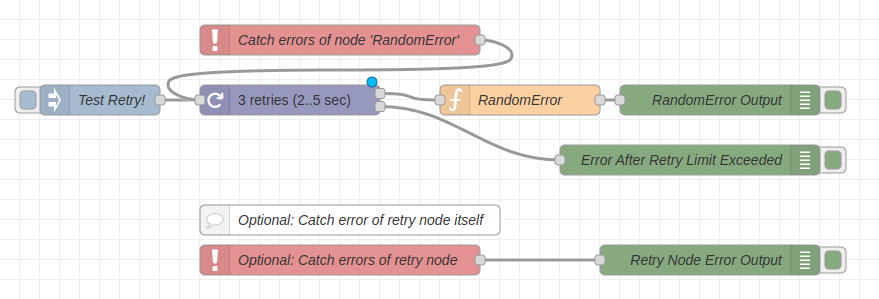
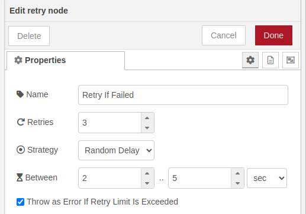

# Configurable retry mechanism for Node-RED flows.

[](https://nodered.org)
[](https://badge.fury.io/js/@waldbaer%2Fnode-red-retry)
[](https://opensource.org/licenses/MIT)
[](https://github.com/waldbaer/node-red-retry/issues)
[](https://github.com/waldbaer/node-red-retry/actions/workflows/node.js.yml)
[](https://coveralls.io/github/waldbaer/node-red-retry?branch=master)

A user-friendly node for configurable retry handling in Node-RED flows.

# Features

- Limit number of retry approaches.
- Different retry strategies:
  - Immediate
  - Fixed Delay
  - Random Delay
- Routing/Re-Throwing of subsequent errors if retries limit is exceeded.

# Installation
You can install the nodes using the Node-RED 'Manage palette' in the side bar.

Or run the following command in the root directory of your Node-RED installation

```
npm install @waldbaer/node-red-retry
```
[](https://www.npmjs.com/package/@waldbaer/node-red-retry)


# Changelog
Changes can be followed [here](/CHANGELOG.md).

# Usage

## Introduction

### Wiring

1) Add a _retry_ node before a flow section which might fail.
2) Add a _catch_ node and catch all errors of the node(s) which might fail with errors.
   It is recommended to catch only errors from the potentially failing nodes
   (_catch_ node option: Catch errors from 'selected nodes').
3) Connect the output of the _catch_ node to the input of the _retry_ node.



### Configuration

- Set max. number of retry approaches
- Configure used retry strategy.
- Optional: Enable throwing of every subsequent error `msg` as error if the retries limit is exceeded.



## Examples
Import into Node-RED instance via Node-RED -> Import -> Examples -> @waldbaer/node-red-retry.
